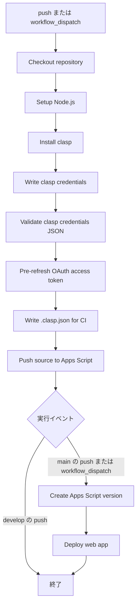
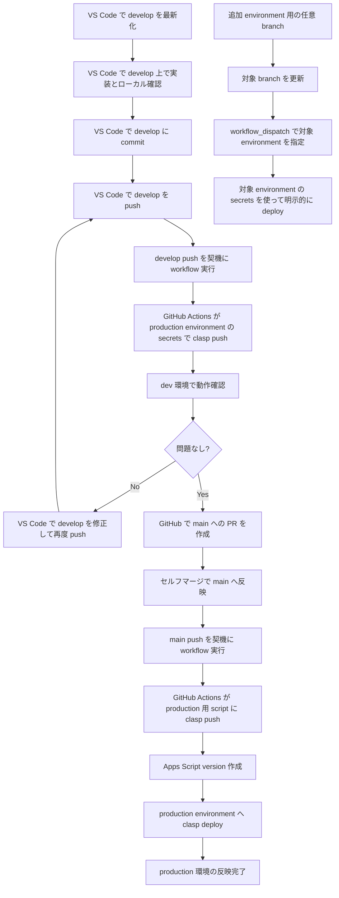

# Deploy GAS CI/CD フロー

`artifacts/.github/workflows/deploy-gas.yml` で実現している CI/CD の流れをまとめたドキュメントです。

## 目的

GitHub の特定ブランチへの push、または手動実行をトリガーにして、Google Apps Script に対して `clasp` 経由でソースを反映します。基本思想は以下です。

- `develop` はデフォルトの script ID に対する `clasp push` のみを連動する
- `main` は `production` environment に定義した本番環境への `clasp deploy` を連動する
- 将来的な追加 environment は、任意の branch と environment secrets を組み合わせて明示的に deploy できるようにする

## トリガー

### 1. push

- 対象ブランチ
  - `develop`
  - `main`

### 2. workflow_dispatch

- 手動実行可能
- 入力項目
  - `target_environment`
- `target_environment` が未指定の場合は `production` を利用します

### push 時の environment 選択

- `develop` への push は `production` environment を利用
- `main` への push も `production` environment を利用
- branch 名と environment 名は一致しない前提

## 実行環境

- `ubuntu-latest`
- concurrency 制御あり
  - `gas-deploy-${{ github.event_name }}-${{ github.ref_name }}`
- 連続実行のキャンセルはしない

## 必要な secrets

この workflow は GitHub Environment に設定された以下の secrets を利用します。

- `CLASP_CREDENTIALS_JSON`
- `CLASP_SCRIPT_ID`
- `CLASP_DEPLOYMENT_ID`  
  - 任意
  - 既存 deployment を更新する場合に利用

## フロー概要

## メンバー開発フローと CI/CD の接続

### このフローの見方

- 開発メンバーが 1 名の間は、特別な理由がない限り `develop` へ直接 commit / push して開発環境確認を行います。
- 競合回避や検証分離など特別な理由がある場合のみ、作業ブランチを作成して運用します。
- `develop` へのマージは、`production` environment の secrets を使った `clasp push` のみを連動します。`clasp deploy` は想定していません。
- `main` へのマージは、`production` environment に定義済みの secrets を使った本番向け `clasp deploy` に連動します。
- 追加 environment は、別 script ID や別スプレッドシートを前提に、任意 branch と対応 secrets を用意した上で明示的に deploy する運用を想定しています。

## 各ステップの詳細

### 1. Checkout repository

`actions/checkout@v4` でリポジトリを取得します。

### 2. Setup Node.js

Node.js `20.20.2` をセットアップします。

### 3. Install clasp

`@google/clasp` をグローバルインストールし、`node -v` と `clasp --version` を確認します。

### 4. Write clasp credentials

`CLASP_CREDENTIALS_JSON` を `.clasprc.json` として書き出します。

ここで secret が未設定なら失敗します。

### 5. Validate clasp credentials JSON

`.clasprc.json` の JSON 構造を検証し、以下の必須項目を確認します。

- `tokens.default.refresh_token`
- `tokens.default.client_id`
- `tokens.default.client_secret`

### 6. Pre-refresh OAuth access token

`oauth2.googleapis.com/token` に対して refresh token を使い、事前に access token を更新します。

目的は、`clasp push` 時の認証失敗を減らすことです。

### 7. Write .clasp.json for CI

`CLASP_SCRIPT_ID` を元に `.clasp.json` を生成します。

これにより、CI 上でも対象 GAS プロジェクトを明示できます。`develop` の自動反映も、この script ID を対象にした `clasp push` として動作します。

### 8. Push source to Apps Script

`clasp push --force` を実行します。

- 最大 5 回リトライ
- 失敗時は待機時間を増やしながら再試行
  - 5秒
  - 10秒
  - 15秒
  - 20秒
  - 25秒

### 9. Create Apps Script version

次の条件のときだけ実行されます。

- `workflow_dispatch`
- `main` ブランチへの push

`clasp version "CI ${GITHUB_SHA}"` を実行し、Apps Script の version を作成します。

### 10. Deploy web app

次の条件のときだけ実行されます。

- `workflow_dispatch`
- `main` ブランチへの push

`CLASP_DEPLOYMENT_ID` があればそれを指定して `clasp deploy` を実行します。  
未設定の場合は新規/既定の deployment として `clasp deploy` を実行します。

このステップは `develop` では実行されません。`main` または明示的な手動実行時にのみ、本番または指定 environment への deploy が行われます。

## ブランチごとの挙動

### `develop`

- `production` environment の secrets を使ってデフォルト script ID 向けの `clasp push` を実行
- version 作成しない
- `clasp deploy` は実行しない
- production deployment は更新しない

### `main`

- production 向け script への `clasp push`
- version 作成
- `production` environment への `clasp deploy`

### 追加 environment 用 branch

- 対応する environment secrets を事前登録する
- 任意 branch を用意して運用する
- 別 script ID や別スプレッドシートを対象にできるようにする
- `workflow_dispatch` で対象 environment を明示して deploy する

### 手動実行

- `clasp push`
- version 作成
- deployment 更新
- 実行時に対象 environment を指定可能

## 期待する運用

- 開発メンバーが 1 名の間は `develop` への直接 commit / push を基本とする
- 特別な理由がある場合のみ作業ブランチを利用する
- `develop` はデフォルト script ID への `clasp push` トリガー
- `main` は `production` への `clasp deploy` トリガー
- branch 名と environment 名は 1:1 で一致させない
- GitHub Environments で environment ごとに secrets を分ける
- 追加 environment は任意 branch と明示的 deploy で運用する
- `production` は初期化時の標準 environment

## 補足

この CI/CD は、以下の前提で組み込まれています。

- 初回構築時に `artifacts/.github/workflows/deploy-gas.yml` を新規プロジェクトへコピーする
- `clasp login` 済みの認証情報を `CLASP_CREDENTIALS_JSON` として GitHub に登録する
- `gh auth login` 済みの GitHub CLI を使って environment secret を登録する
- `production` environment を最低限用意する

## 関連ファイル

- [README.md](README.md)
- [init-gas-project.ps1](init-gas-project.ps1)
- [register-gas-environment-secrets.ps1](register-gas-environment-secrets.ps1)
- [check-gas-init-prerequisites.ps1](check-gas-init-prerequisites.ps1)
- [installers/install-gas-prerequisites.ps1](installers/install-gas-prerequisites.ps1)
